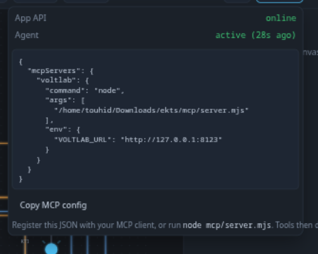
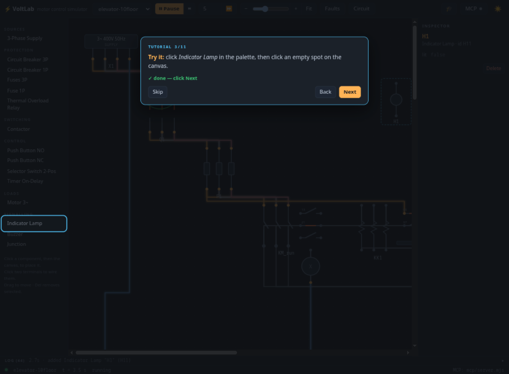

# ⚡ VoltLab — Motor Control Circuit Simulator

[](https://github.com/touhidsiddiqueeraj-bit/VoltLab/actions/workflows/ci.yml)
[](LICENSE)
[](package.json)
[](https://www.electronjs.org/)
[](https://modelcontextprotocol.io/)

A minimal, cross-platform simulator for **electromechanical motor-control circuits** —
DOL starters, interlocks, seal-in logic, on-delay sequencing, reversing starters, even a
full 10-story relay elevator. Place contactors, thermal overloads, push buttons, lamps and
3-phase motors on a schematic, wire them terminal-by-terminal, and watch the live
simulation: phase-colored wires, inrush current, overload trips, coast-down.

And the twist: the whole app is **agent-controllable over MCP** — an LLM agent can build,
wire, break, fault, document and film circuits entirely through tool calls.


https://github.com/touhidsiddiqueeraj-bit/VoltLab/raw/main/docs/media/dol-starter-demo.mp4

> *The app scripting its own demo video: press START → seal-in holds → STOP → coast-down.*
> *(Click the link above to play — GitHub doesn't inline-play repo videos.)*

---

## Highlights

- **Live physics, not animation** — a real per-tick solver: union-find netlists, phase
  propagation, 6× FLC inrush, class-10 thermal trip curves, single-phasing after phase
  loss, motor coast-down, fuse blowing on short circuit.
- **16 device types** with IEC-style SVG symbols drawn in-phase-colors: supplies,
  breakers, fuses, contactors (main + NO/NC aux + coil), thermal overloads (95-96 / 97-98),
  on-delay timers, NO/NC push buttons, selectors, lamps, buzzer, floor cams, junctions.
- **MCP agent layer** — 26 tools over stdio JSON-RPC or plain HTTP. Point Claude/ZCode/any
  MCP client at it and it runs the panel like a virtual training bench.
- **Self-documenting exports** — the app produces an IEC 61082-1-style multi-sheet PDF
  drawing set (zone grids, title blocks, sheet index) and a scripted 720p demo video of
  any circuit, on demand, from the GUI *or* from an agent tool call.
- **Light + dark themes**, minimal chrome, zoom (25–300 %, Ctrl+wheel, Fit), inspector,
  collapsible event log, and an **11-step interactive tutorial** with action gates.
- **Zero runtime dependencies** — the server, simulator and MCP bridge are pure Node
  stdlib. Electron is the only (dev) dependency.

## Quick start

**⚡ Live demo, zero install:** the `docs/` folder doubles as a
[GitHub Pages](https://pages.github.com/) site with the **real simulator running in your
browser** — enable *Settings → Pages → Deploy from branch → `main` → `/docs`* and open
`https://<user>.github.io/VoltLab/`. The demo page embeds the actual `sim/engine.js`
(client-side; no backend needed for the interactive tour).

```bash
git clone https://github.com/touhidsiddiqueeraj-bit/VoltLab.git
cd voltlab

npm install            # once — installs Electron only

npm run serve          # browser mode → http://127.0.0.1:8123  (auto-loads the DOL demo)
# or
npm start              # Electron desktop window (same app, same API)
```

The UI is deliberately minimal: one toolbar (run / step / advance + **Faults** and
**Circuit** menus), a text palette on the left, an inspector on the right, and a
collapsible event-log drawer with a live ticker. Click a palette entry, click the canvas
to place; click two terminals to wire. The 🎓 button starts the interactive tutorial.

### First scenario (60 seconds)

1. The **DOL starter** demo loads running — breaker Q1 on, **H1** power lamp lit.
2. Click the **S1 START** button → contactor **KM1** picks up, the motor spins up,
   **H2** lights. Release — the seal-in aux contact 13-14 keeps it running.
3. Click **S0 STOP** → contactor drops, motor coasts down.
4. **Faults ▸ Stall rotor**, then START again → locked rotor draws ~60 A → after ~15 s
   **KK1 trips**, the contactor drops and **H3** lights. Click the red **RESET** on the
   overload to recover.


## Example circuits

Five worked examples ship in [`circuits/`](circuits/) — each validated headlessly in
[`test/examples.test.mjs`](test/examples.test.mjs). Ideas, wiring walk-throughs and
exercises per circuit live in [`docs/examples.md`](docs/examples.md).

| Circuit | What it demonstrates |
|---|---|
| `dol-starter` | Direct-On-Line start/stop, seal-in holding, class-10 overload trip, trip lamp |
| `reversing-starter` | Forward/reverse contactors, phase-swap wiring, electrical interlock that makes simultaneous energizing impossible |
| `timer-sequence` | On-delay timer starts a second conveyor motor 3 s after the first |
| `elevator-2floor` | Call latching for up/down contactors, travel limits, NC cross-interlock, hoist overload |
| `elevator-10floor` | **Full 10-story relay elevator**: 3-deck floor cam = car position, per-floor call relays K1–K10, auto-reset via complement decks, dispatch chain with dwell timer — 46 components, 169 wires |


*The 10-story elevator — the dispatch bank: run contactor, thermal overload, up/down
contactors and the 3-deck floor cam.*


## Documentation

| Doc | Contents |
|---|---|
| [Live demo](https://touhidsiddiqueeraj-bit.github.io/VoltLab/) | The real engine running on GitHub Pages — no install |
| [docs/architecture.md](docs/architecture.md) | How the engine, host, UI and MCP layer fit together; the solver model; design constraints |
| [docs/mcp.md](docs/mcp.md) | Complete 26-tool MCP reference + raw HTTP equivalents + worked agent session |
| [docs/circuit-format.md](docs/circuit-format.md) | The circuit JSON schema — components, wires, waypoints, demo scripts |
| [docs/examples.md](docs/examples.md) | Guided tour of every example circuit with scenarios to try |
| [CONTRIBUTING.md](CONTRIBUTING.md) | Dev setup, test layout, how to add devices and circuits |

## Agent control (MCP)

Start the app (either mode), then register the stdio bridge with your MCP client:

```json
{
  "mcpServers": {
    "voltlab": {
      "command": "node",
      "args": ["/path/to/voltlab/mcp/server.mjs"],
      "env": { "VOLTLAB_URL": "http://127.0.0.1:8123" }
    }
  }
}
```

The bridge is dependency-free, speaks newline-delimited JSON-RPC 2.0 over stdio, and
serves the tool catalog verbatim from [`sim/api.js`](sim/api.js) — the single source of
truth shared with the HTTP API. The toolbar **MCP** button shows the live connection
status and this exact config, ready to copy:



A taste of the 26 tools (full reference in [docs/mcp.md](docs/mcp.md)):

| Group | Tools |
|---|---|
| Build | `add_component`, `connect`, `disconnect`, `move_component`, `remove_component`, `list_terminals` |
| Operate | `press_button`, `release_button`, `set_switch`, `set_position`, `set_param` |
| Break | `inject_fault` (phase_loss / overload / stall / short_circuit), `clear_fault`, `replace_fuses`, `reset_overload` |
| Observe | `get_state`, `list_components`, `list_wires`, `get_log`, `sim_control` (run/pause/step/advance/reset) |
| Library | `load_circuit`, `save_circuit`, `clear_circuit` |
| Document | `export_pdf`, `export_video`, `screenshot` |

The same catalog is reachable without MCP — plain HTTP:

```bash
curl -X POST http://127.0.0.1:8123/api/command \
  -H 'Content-Type: application/json' \
  -d '{"tool": "press_button", "args": {"id": "S1"}}'

curl http://127.0.0.1:8123/api/state | jq    # full snapshot (or stream /api/events via SSE)
```

## Self-documenting exports

**Circuit ▸ Export PDF report** produces a proper drawing set, not a shrunken screenshot:

- **Sheet 1 — index**: title block, full-circuit overview with numbered tile map, sheet index (zone → sheet)
- **Sheets 2…n — schematic** tiled 1:1 across A4-landscape sheets with overlap, IEC-style zone reference grids and per-sheet title blocks
- Then symbol legend, component list and event log, in a light print theme


**Circuit ▸ Record demo video** makes the app *perform its own circuit*: per the circuit's
`demo` script it presses every button on the live simulation while recording 720p @ 25 fps
with per-step captions and a camera that eases toward whatever it's operating. Saved under
`exports/` as webm, transcoded to mp4 when ffmpeg is available.

Both exports are also agent tools (`export_pdf`, `export_video`) — an agent can document
any circuit it builds.

## Tutorial

The 🎓 button runs an 11-step interactive tutorial: palette + placement, wiring terminals,
running the DOL starter (press START, watch seal-in, STOP), overload faults and reset,
then tours of the Circuit/MCP menus. Steps marked 👆 stay locked until you actually
perform the action.



## Tests & packaging

```bash
npm test                        # engine + example-circuit tests + MCP end-to-end (31 tests)
node --test test/dol.test.mjs   # just the DOL physics scenario (14 tests)
npm start -- --smoke            # Electron headless self-test → prints SMOKE OK
npm start -- --screenshot=out.png   # load demo, capture PNG, exit
npm run package                 # standalone linux-x64 build → dist/VoltLab-linux-x64
```

- Engine tests drive the real DOL scenario headlessly: pick-up, seal-in, trip timing,
  phase loss, fuse blowing — no browser involved.
- `test/mcp.e2e.mjs` spawns the real HTTP host **and** the real MCP stdio server, then
  drives the full user scenario purely through `tools/call` (24 checks).

## Project layout

```
sim/devices.js    device registry: terminals, params, defaults (shared by engine & renderer)
sim/engine.js     the solver: per-tick DSU netlist, phase propagation, thermal model
sim/api.js        tool catalog + dispatcher — single source of truth for HTTP and MCP
server.js         dependency-free HTTP host: static app/, /api/*, SSE state stream
app/              the web UI (IEC SVG symbols, palette, wiring, inspector, log drawer)
electron/main.mjs Electron shell (+ --smoke / --screenshot / --headless / --check modes)
mcp/server.mjs    MCP stdio server → proxies tools/call to the HTTP API
circuits/         circuit library (5 examples, JSON)
scripts/          generator for the 10-floor elevator circuit + demo-page sync
test/             engine tests + example-circuit tests + MCP end-to-end
docs/             GitHub Pages site: landing page + live demo + deep-dive docs
```

## Environment variables

| Variable | Purpose |
|---|---|
| `VOLTLAB_PORT` | Server port (default 8123; Electron prints its port if 8123 was taken) |
| `VOLTLAB_AUTOLOAD=none` | Start with an empty canvas instead of the DOL demo |
| `VOLTLAB_URL` | MCP bridge → app URL (default `http://127.0.0.1:8123`) |
| `VL_CHROMIUM_FLAGS` | Comma-separated extra Chromium switches for the Electron shell |

## Acknowledgments

VoltLab is an open, cross-platform reimagining of the ideas behind the classic Windows
EKTS (Electrical Control Techniques Simulator). All code in this repository is original.

## License

[MIT](LICENSE) © 2026 Touhid Siddiquee Raj
