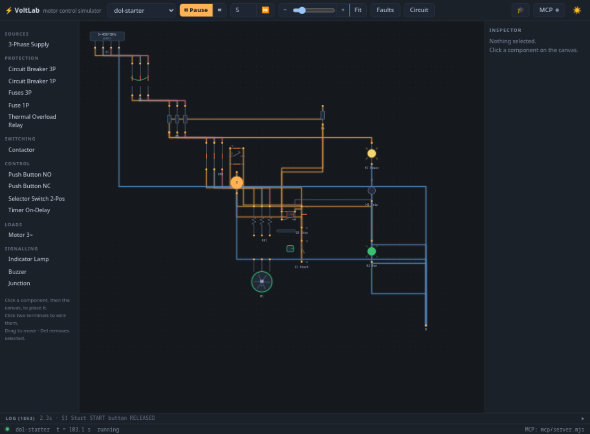
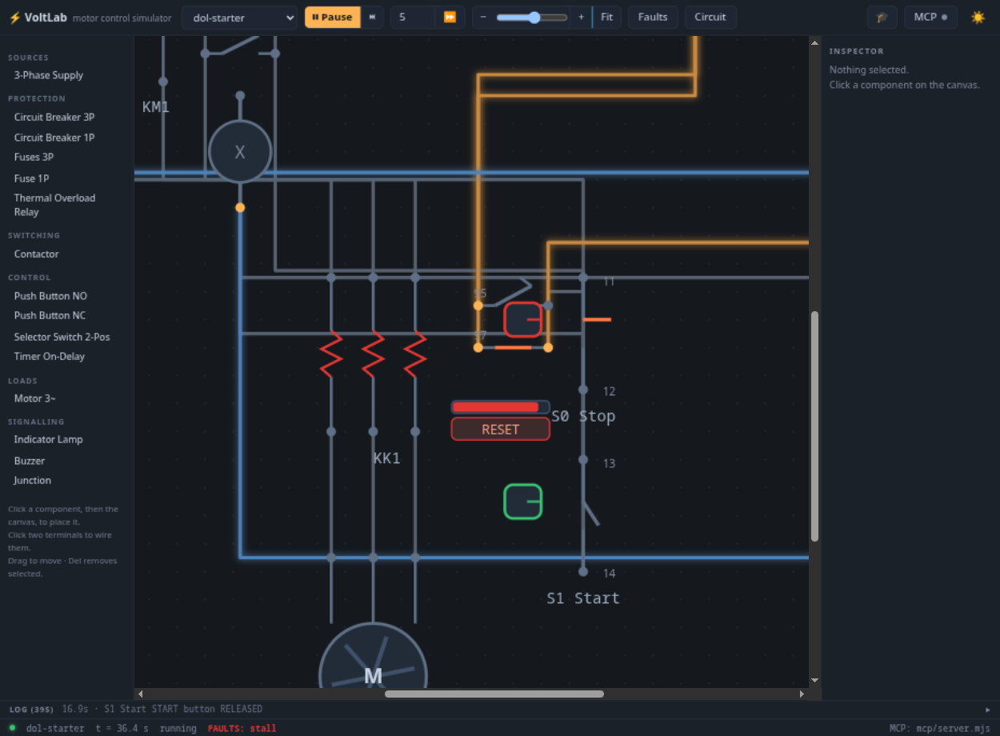
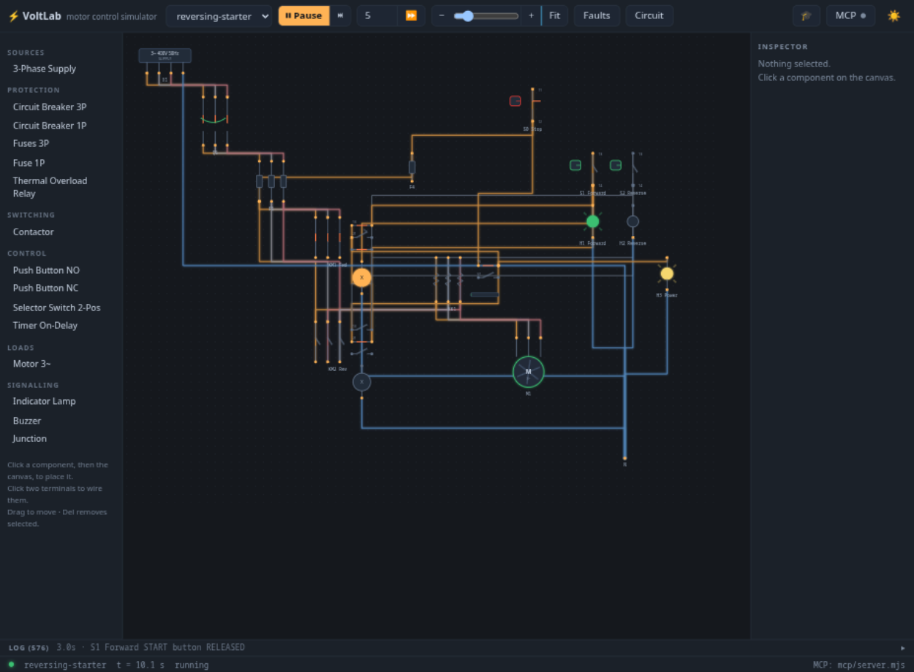
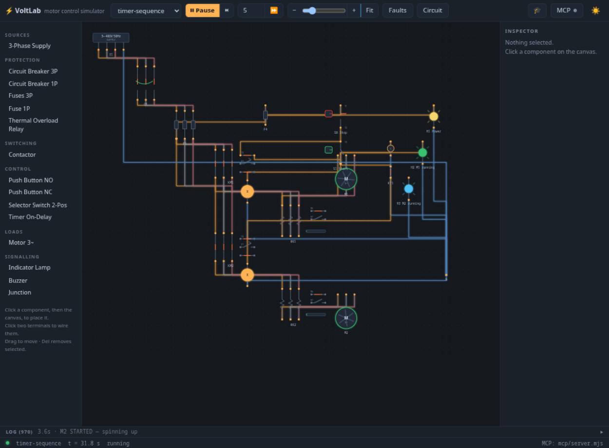
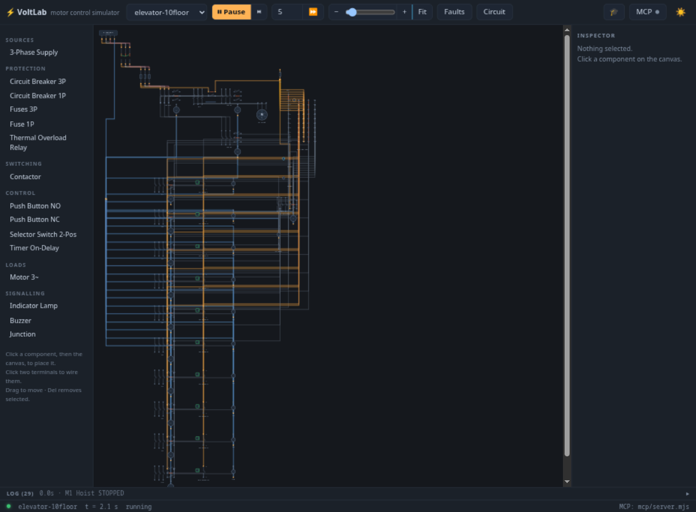
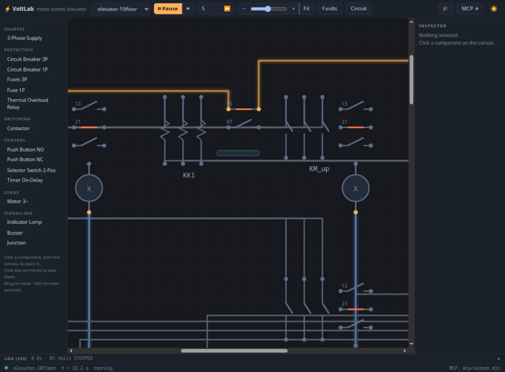
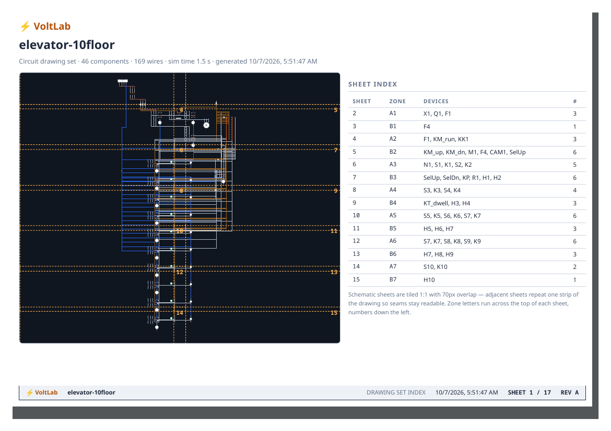
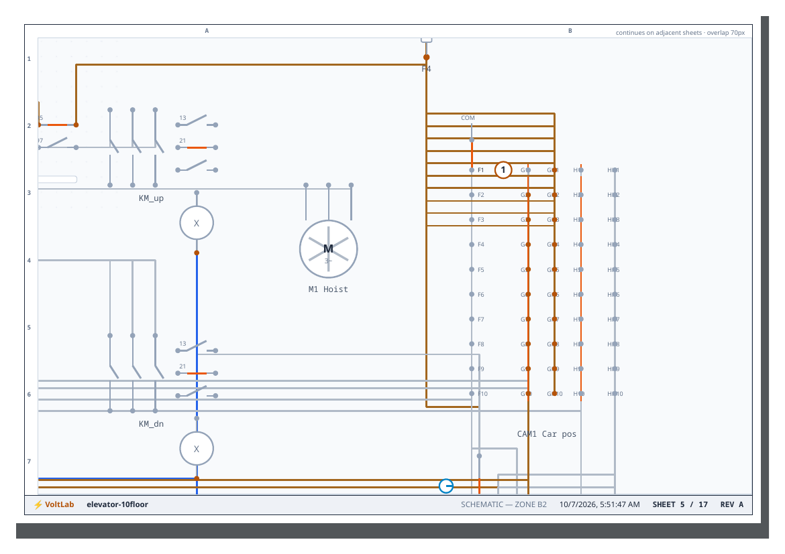

# Example circuits

Five worked examples ship in [`circuits/`](../circuits/). Each one is covered by
headless behavior tests in [`test/examples.test.mjs`](../test/examples.test.mjs) — the
tests assert the *electrical behavior* (what picks up, what trips, what can never
energize simultaneously), so the examples double as executable documentation of what the
engine models.

Load them from the **Circuit ▸** dropdown, via the `load_circuit` tool, or
`VOLTLAB_AUTOLOAD=dol-starter node server.js` to boot straight into one.

---

## dol-starter — the canonical demo

A complete Direct-On-Line motor starter, laid out like a real panel drawing:

- **Power circuit** (top): supply X1 → breaker Q1 → fuses F1 → contactor KM1 mains →
  thermal overload KK1 → motor M1
- **Control circuit** (fused separately by F4): KK1 NC 95-96 → STOP S0 (NC) → START S1
  (NO) **∥ KM1 aux 13-14 (seal-in)** → coil A1-A2 → N
- **Signalling**: H1 power, H2 run (across the coil), H3 trip (via KK1 NO 97-98)

**What the engine models here:** 6× FLC inrush, class-10 thermal trip curve (~14.5 s at
locked rotor for a 10 A setpoint), seal-in holding across button release, single-phasing
after a phase loss, coast-down, fuse blowing on short circuit.

**Try it:**

1. Press **S1** — KM1 picks up, motor spins, **H2** lights. Release — seal-in holds.
2. Press **S0** — drops, coasts down.
3. **Faults ▸ Stall rotor**, START again → ~15 s later KK1 trips, **H3** lights. Click
   the red **RESET** on KK1 to recover.

**Exercise:** swap S1's seal-in for a `selector2` in position I and compare behavior —
what happens on power loss and restoration?

---

## reversing-starter

Forward/reverse contactors KM1/KM2 with a **phase-swap** on the motor (L1↔L3) and an
**electrical interlock**: each contactor's NC aux 21-22 sits in the other's coil branch,
making simultaneous energizing electrically impossible — pressing Reverse while running
Forward first drops KM1, and only then can KM2 pick up.

**Try it:** run Forward (S1), then press Reverse (S2) and watch the event log — KM1
drops before KM2 may pick. **Exercise:** try adding a *mechanical*-interlock-style
double-coil pushbutton and compare.

---

## timer-sequence

Conveyor-style sequencing: S1 starts KM1/M1; the same feed energizes on-delay timer
KT1 (3 s); KT1's contact 15-16 then starts KM2/M2. Both overloads (KK1, KK2) sit in a
series chain back to the coils, so **either** trip stops **both** motors.

**Try it:** press S1, watch the ticker — `KT1 timed out — contact 15-16 closed` ≈3 s
later, then `M2 STARTED`. **Exercise:** set `KT1.delay` to 8 s via `set_param` or the
inspector; trip KK2 and confirm M1 stops too.

---

## elevator-2floor

The minimal elevator: call buttons latch per direction, up/down contactors KM_up/KM_dn
drive the hoist between two limit switches, NC cross-interlocks prevent reversing while
moving, KK1 guards the hoist motor. Good for understanding the *call-latch* pattern
before looking at ten floors of it.

**Try it:** call the car from the other floor, watch the direction contactor latch and
the limit switch kill the run contactor at arrival.

---

## elevator-10floor — the showcase

A **full 10-story relay elevator** in plain relay logic — 46 components, 169 wires, and
no microcontroller anywhere. Built by [`scripts/generate_elevator10.py`](../scripts/generate_elevator10.py);
its per-floor branches are a great study in generated-but-readable schematics.

Key ideas:

- **3-deck floor cam (`CAM1`)** models the car position. Deck A is COM→F(*position*);
  decks B/C close G/GH and H/HH contacts for every floor **except** the current one —
  the per-floor isolation that a shared junction can't give you (junction-merged
  branches backfeed and self-hold; a classic relay trap the complement decks avoid).
- **Per-floor call relays K1–K10** latch on car button presses (S1–S10) with their own
  seal-ins and lamps H1–H10.
- **Dispatch chain:** a call at floor n → K(n) → KP (dispatch) → KM_run, gated by the
  cam decks so the car only starts when called *away* from its current floor.
- **Auto-reset:** when the cam reaches a called floor, that call resets through the
  complement deck; remaining calls re-dispatch automatically after a 1.5 s dwell
  (`KT_dwell`).
- **Protection:** an overload trip locks out dispatch entirely.

**Try it:** press car buttons for floors 8 and 3, watch the call lamps latch, the run
contactor pick, the dwell at each floor, and the calls extinguish in order.
`set_position` moves the car instantly if you want to jump around.

**Exercise:** trip KK1 mid-run, reset it, and confirm dispatch resumes only after the
overload is healthy.

---

## The PDF drawing set

Any of these can be exported (**Circuit ▸ Export PDF report**) as an IEC 61082-1-style
drawing set — sheet index with tile map, 1:1 tiled A4-landscape schematic sheets with
zone grids, title blocks, legend, component list and event log. The elevator set runs
17 schematic sheets:

